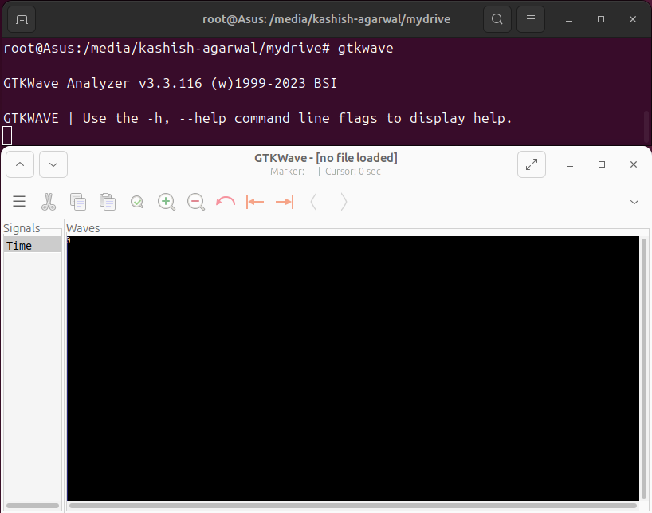

# Getting started with Digital VLSI SOC Design and Planning
The process of getting started with Digital VLSI SoC design and planning begins with chip modeling, where specifications are captured in a high-level C model (O0/O1) and validated using a C-based testbench. This model is then translated into an RTL description (O2) using Verilog, representing the processor and its peripherals. From the RTL, synthesis produces gate-level netlists, macros, and analog IPs, which are integrated at the SoC integration stage (O3). The complete SoC undergoes floorplanning, placement, clock tree synthesis, and routing before signoff checks like DRC/LVS, leading to the final GDSII file for fabrication. The outputs of these design stages (O1, O2, O3, O4) must remain consistent to ensure functional correctness across models. Such a design flow enables SoCs to be applied in real-world devices like smartwatches, Arduino boards, TV panels, and AC applications.

---

# Tools Installation

## System Configuration
- **OS**: Ubuntu 20.04+
- **RAM**: 6 GB
- **Disk**: 50 GB HDD
- **CPU**: 4 vCPUs

## 1. Yosys Installation Commands
Yosys is an open-source framework for Verilog synthesis, converting RTL into gate-level netlists.
```bash
sudo apt-get update
git clone https://github.com/YosysHQ/yosys.git
cd yosys
sudo apt install make
sudo apt-get install build-essential clang bison flex \
libreadline-dev gawk tcl-dev libffi-dev git \
graphviz xdot pkg-config python3 libboost-system-dev \
libboost-python-dev libboost-filesystem-dev zlib1g-dev
make config-gcc
make
sudo make install
```

#### Installation Verification


## 2. Icarus Verilog (iverilog) Installation Commands
Icarus Verilog (iverilog) is a Verilog simulator and compiler for verifying RTL designs.
```bash
sudo apt-get update
sudo apt-get install iverilog
```

#### Installation Verification


## 3. GTKWave Installation Commands
GTKWave is a waveform viewer for visualizing simulation outputs of digital circuits.
```bash
sudo apt-get update
sudo apt-get install gtkwave
```

#### Installation Verification

